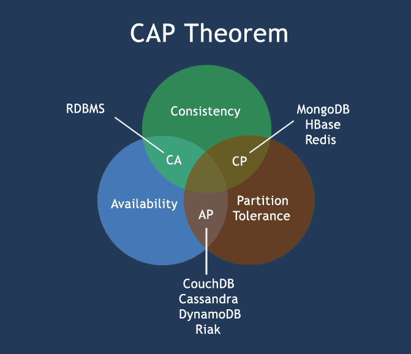

# CAP теорема

## Цель: В результате выполнения ДЗ вы научитесь работать с гитом.

Необходимо написать к каким системам по CAP теореме относятся перечисленные БД и почему:
* MongoDB
* MSSQL
* Cassandra.

ДЗ сдается ссылкой на гит, где расположен мини-отчет в маркдауне.
Критерии оценки: Критерии оценки:

* задание выполнено - 5 баллов
* предложено красивое решение - плюс 1 балл
* предложено рабочее решение, но не устранены недостатки, указанные преподавателем - минус 1 балл

---

## Решение
Из предстваленных  баз данных (MongoDB, MSSQL,  Cassandra)  распределенным в честном смысле этого слова, являются лишь Mongo и Cassandra, что означает им автоматической присвоение - литеры P.

### **MSSQL:**

* Availability - доступность, обеспечивается единственным лидером, и свойство будет отсутствовать, если будет сконфигурировано в режиме Master-Slave.
* Consistency - если чтение и запись идет через мастера, то свойство становится активным, иначе свойство теряется, поскольку в репликации так или иначе может присутствовать лаг чтения от записи.

Таким образом, для MSSQL характерны комбинации CA, A или C.

### **Mongo:**

* Consistency - по умолчанию Mongo сконфигурирована, на чтение и запись с лидера, поэтому свойство ей присуще, но в это случае, если лидер уйдет - теряется свойство Availability, так как при потере лидера, клиенты будут отключены от него.
* Availability - Если сконфигурировать Mongo и разрешить клиентам читать с реплик, то мы получаем свойство Availability, но теряем Consistency, поскольку реплики  могут иметь  лаг в только что записанных данных.

Таким образом, для Mongo характерны комбинации CP или AP - но без возможности записи - то есть без C.

### **Cassandra:**

* Consistency - по умолчанию координаторы нод. возвращают управление на клиента, если удалось записать хотя бы на 1 ноду, но  чтение уже может пройти не с это ноды, поэтому свойство пв такой конфигурации отсутствует.
* Availability - Можно сконфигурировать свойство для чтения их бд в режиме ALL или  Number (где Number - число нод ) - тогда БД будет добиваться согласованного чтения, но это приведет к недоступности свойства   Availability , при потери одной  кластер на чтение будет не доступен.

Таким образом, для Cassandra характерны комбинации AP по умолчанию и CP  в конфигурации  чтения.

### Диаграмма размещения БД по свойствам CAP  теоремы

---
## Материалы

### Статьи
* [Please stop calling databases CP or AP](https://martin.kleppmann.com/2015/05/11/please-stop-calling-databases-cp-or-ap.html)
* [where-does-mongodb-stand-in-the-cap-theorem](https://stackoverflow.com/questions/11292215/where-does-mongodb-stand-in-the-cap-theorem)
* [CAP Theorem](https://www.ibm.com/cloud/learn/cap-theorem)

### Видео 

