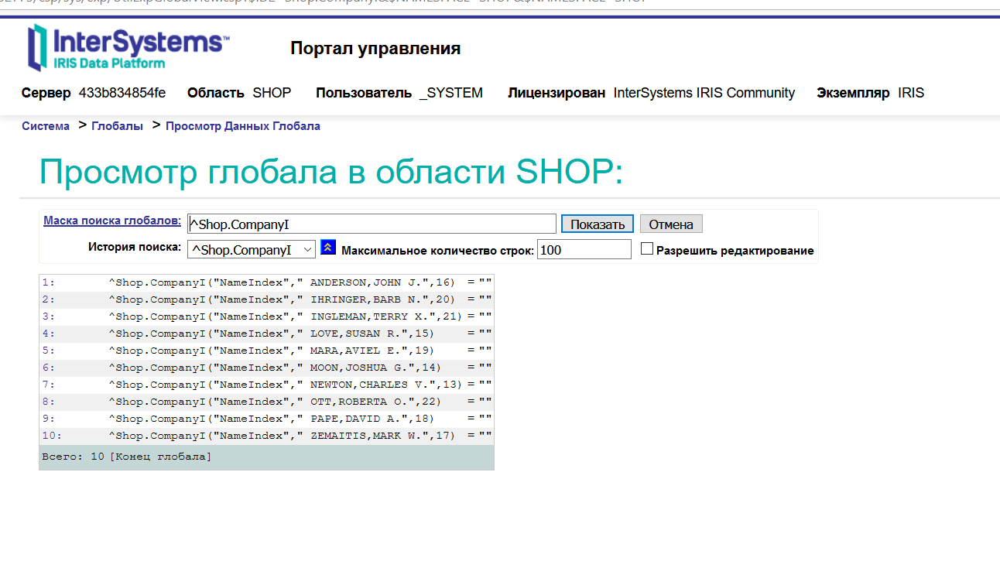

# InterSystems Caché / IRIS

## Необходимо:
- развернуть InterSystems Caché / IRIS;
- разработать БД для простейшего магазина с сущностями: заказы, позиции заказа, заказчик (по методичке в материалах занятия). 

---
## Решение 

## Разворачиваем БД

```
docker run -d -p 52773:52773 --name intersystems_iris intersystemsdc/iris-community:2020.4.0.524.0-zpm
```

## Проектируем БД и схему




---
Доп задание делать не стал - тут и так пахнет нафталином :)