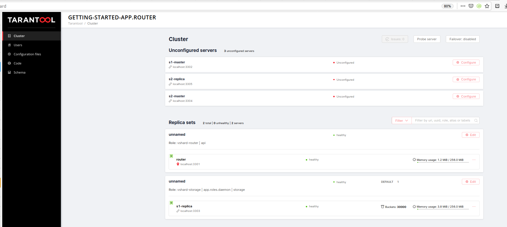

# 

## Необходимо написать на тарантуле биллинг реального времени облачной системы. Должны быть хранимые процедуры:

* добавление денег на баланс;
* изменение расхода денег в секунду.

Когда баланс становится равным нулю, тарантул по http должен сделать GET-запрос на какой-либо внешний урл, где передать userID пользователя, у которого кончились деньги (запрос на отключение виртуальных машин). Этот вызов должен происходить как можно быстрее после окончания денег на счете.

Для реализации рекомендуется использовать библиотеку expirationd.

Использовать шардинг на основе vshard. 

---

## Решение

### Создаем каркас приложения 

* [Устанавливаем локально](https://github.com/tarantool/cartridge-cli#installation)  пакеты для раз работки Tarantool 
* Необходимо обновить  пакет  tarantool-dev до версии 2.5   - иначе  будут ошибки при сборке приложения через tarantool cartrige в части сборки rockspec
* Создаем  каркас приложения - поскольку в приложении используется сокет, а его имя в linux ограничего 108  символами - желательно  делать в директории от /

```
    cartridge create --name src
```
* Запускаем Tarantool Cartrige

```
    cartridge build && cartridge start
```

* [подключаемся  на консоль cartridge](http://localhost:8081/admin)


* Регистрируем шарды -  на  узел назначаем роль обработчика  http и storage, на другой узел - storage  и созданный в последсвии роль daemon

* Остаанвливаем консоль

* Создаем роль приложения

    - [storage.lua](../tarantool/app/src/app/roles/storage.lua) - роль для работы с СУБД
    - [api.lua](../tarantool/app/src/app/roles/api.lua) - роль для обработки WEB запросов
    - [daemon.lua](../tarantool/app/src/app/roles/daemon.lua)   - роль с фоновым обработчиком следящим за тратами

* Собираем приложение и запускаем Tarantool Cartrige

```
    cartridge build && cartridge start
```

* Создаем данные через web-api

*Пользователь*
```
    curl -X POST -v -H "Content-Type: application/json" -d '{"customer_id":18, "name": "Victor", "accounts":[{"account_id":22, "name": "Victor"}]}' http://localhost:8081/storage/customers/create
```

*Добавляем денг на счет*

```
    curl -X POST -v -H "Content-Type: application/json" -d '{"amount":"18", "account_id":22}' http://localhost:8081/storage/customers/18/update_balance
```

*Расход денег в секунду*

```
    curl -X POST -v -H "Content-Type: application/json" -d '{"consumption":"18", "account_id":22}' http://localhost:8081/storage/customers/18/update_consumption
```

Пример работы демона в логе
```
getting-started-app.s1-replica | 2021-01-01 17:54:41.208 [1212707] main/131/worker of "clean_all" I> send signall to poweroff
getting-started-app.s1-replica | 2021-01-01 17:54:41.211 [1212707] main/131/worker of "clean_all" I> status 200
getting-started-app.s1-replica | 2021-01-01 17:54:41.211 [1212707] main/131/worker of "clean_all" I> job Worked 182.00 increase -33670.00
getting-started-app.s1-replica | 2021-01-01 17:54:43.212 [1212707] main/131/worker of "clean_all" I> send signall to poweroff
getting-started-app.s1-replica | 2021-01-01 17:54:43.215 [1212707] main/131/worker of "clean_all" I> status 200
getting-started-app.s1-replica | 2021-01-01 17:54:43.215 [1212707] main/131/worker of "clean_all" I> job Worked 182.00 increase -33852.00
getting-started-app.s1-replica | 2021-01-01 17:54:45.216 [1212707] main/131/worker of "clean_all" I> send signall to poweroff
getting-started-app.s1-replica | 2021-01-01 17:54:45.219 [1212707] main/131/worker of "clean_all" I> status 200
getting-started-app.s1-replica | 2021-01-01 17:54:45.219 [1212707] main/131/worker of "clean_all" I> job Worked 182.00 increase -34034.00
getting-started-app.s1-replica | 2021-01-01 17:54:47.219 [1212707] main/131/worker of "clean_all" I> send signall to poweroff
getting-started-app.s1-replica | 2021-01-01 17:54:47.221 [1212707] main/131/worker of "clean_all" I> status 200
getting-started-app.s1-replica | 2021-01-01 17:54:47.221 [1212707] main/131/worker of "clean_all" I> job Worked 182.00 increase -34216.00
getting-started-app.s1-replica | 2021-01-01 17:54:49.222 [1212707] main/131/worker of "clean_all" I> send signall to poweroff
getting-started-app.s1-replica | 2021-01-01 17:54:49.225 [1212707] main/131/worker of "clean_all" I> status 200
getting-started-app.s1-replica | 2021-01-01 17:54:49.225 [1212707] main/131/worker of "clean_all" I> job Worked 182.00 increase -34398.00

```

* создаем [WEB-обработчик](../tarantool/web-handler.py) для отключения машин

* проверим как Taantool Cartrige [разворачивается](../tarantool/deploy/terantool-operator.tf) в kubernetes кластере

---
### Материалы:

* [Tarantool Data Grid](https://github.com/tarantool/tarantool-operator/tree/master/examples/tarantool-data-grid)
* [Tarantool Kubernetes operator](https://tarantool.github.io/tarantool-operator)
* [Пример deployment для развертывания в k8s](https://github.com/dstdfx/tarantool-load-testing/blob/a1bc158880b1c486a76ad7f7335e6ff9a8e5d73d/kv-app/deployment.yaml)
* [Tarantool Kubernetes guide](https://github.com/tarantool/tarantool-operator/blob/master/doc/cartridge_kubernetes_guide/index.rst)
* [Пример приложения](https://github.com/tarantool/cartridge-cli/blob/maslster/examples/getting-started-app/README_RUS.md)
* [Модуль expirationd](https://www.tarantool.io/ru/doc/latest/reference/reference_rock/expirationd/)
