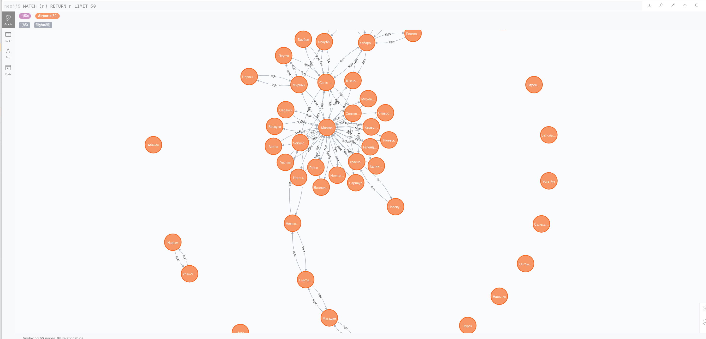

# Neo4j

## Необходимо (на выбор):

❌ сделать базу данных для своего круга знакомых (кто с кем общается)  
✅ сделать базу данных для авиакомпании (как куда лететь и за какую цену)

---

Аэропорт

Связь между аэропортами содержит цену

* За основу возьмем  [Demo БД](https://medium.com/postgres-professional/%D0%B0%D0%B2%D0%B8%D0%B0%D0%BF%D0%B5%D1%80%D0%B5%D0%B2%D0%BE%D0%B7%D0%BA%D0%B8-%D0%BE%D0%BF%D0%B8%D1%81%D0%B0%D0%BD%D0%B8%D0%B5-%D0%B4%D0%B5%D0%BC%D0%BE%D0%BD%D1%81%D1%82%D1%80%D0%B0%D1%86%D0%B8%D0%BE%D0%BD%D0%BD%D0%BE%D0%B9-%D0%B1%D0%B0%D0%B7%D1%8B-%D0%B4%D0%B0%D0%BD%D0%BD%D1%8B%D1%85-3d56e3643d81)


* Выгрузим данные по аэропортам

    ``` sql
    select airport_code , airport_name, city from bookings.airports
    ```

* Выгрузим данные по стоимости перелета (берем минимальную)
    ``` sql
    select   min(t.amount) as amount , arrival_airport  , departure_airport 
    from  bookings.ticket_flights  t join bookings.flights f
    on f.flight_id = t.flight_id
    group by  arrival_airport  , departure_airport
    ```

* Сохраним все в папку [data](../neo4j/data)

* Примонтируем файлы с выгруженными данными для импорта в Neo4j

    ``` yaml
        volumes:
        - ./data:/bitnami/neo4j/import/data
    ```


* подключаемся  к WEB-интерфейсу Neo4j

    ```
    http://localhost:7474/browser/
    ```

* Создаем аэропорты в консоли запросов

    ``` sql
    LOAD CSV WITH HEADERS  FROM "file:///data/airports.csv"
    AS line
    CREATE (:Airports {code:line.Code, name:line.Name, city:line.City})
    ```

* Создаем связи-перелеты в консоли запросов

    ``` sql
    LOAD CSV WITH HEADERS  FROM "file:///data/flights.csv"
    AS line
    MATCH (p:Airports {code:line.departure_airport})
    MERGE (c:Airports {code:line.arrival_airport})
    CREATE (p)-[:flight{amount: line.amount}]->(c)
    ```

* Результат 
    ```
    MATCH (n) RETURN n LIMIT 50
    ```

    Для 50 нод получаем такую звезду около Москвы



---
материалы:

* [Загрузите CSV в Neo4j быстро и успешно]( https://coderlessons.com/articles/java/zagruzite-csv-v-neo4j-bystro-i-uspeshno)

* [Neo4j: graph database — запуск в Docker и примеры работы с Cypher QL](https://rtfm.co.ua/neo4j-graph-database-zapusk-v-docker-i-primery-raboty-s-cypher-ql/)

* [Начинаем работать с графовой базой данных Neo4j](https://habr.com/ru/post/219441/)


