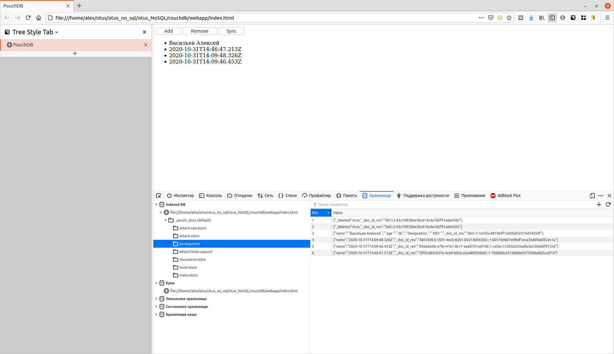

# Знакомство с CouchDB + PouchDB

## Цель: Результат ДЗ - файл с синхронизированными в offline данными из CouchDB. В рамках выполнения ДЗ нужно сделать первое offline-first приложение

* Установить CouchDB или Couchbase – не важно как и куда
* Скачать файл index.html из материалов к занятию
* Создать БД в CouchDB
* Добавить в БД один документ в котором должно быть поле «name», в него запишите свою фамилию.
* Прописать в index.html путь к вашей инсталляции CouchDB или Couchbase
* Запустить index.html и нажать кнопку «sync». Убедиться что ваша фамилия появилась на экране. При необходимости настроить CORS.
* Остановить CouchDB/Couchbase сервер
* Обновить Index.html, нажать sync, убедиться что в нём по прежнему фигурирует Ваша фамилия

Прислать либо сохраненный из chrome (уже с прочитанной фамилией) index.html, либо опубликовать его, к примеру, на githubpages и прислать ссылку.

---

## Решение

1. Создаем [docker-compose](../couchdb/docker-compose.yaml) файл с установкой CouchDBon

2. Создаем БД

``` sh
curl -u admin:couchdb  -X PUT http://127.0.0.1:5984/rep1
```

Загружаем данные

``` sh
$ curl -u admin:couchdb -X PUT http://127.0.0.1:5984/rep1/"002" -d '{ "name" : " Васильев Алексей " , " age " :" 38 " , " Designation " : " DEV " }'
```

3. Прописываем для страницы сервер для синхронизации couchdb

``` javascript
        Remote: new PouchDB('http://127.0.0.1:5984/rep1')
```

4. Смотрим что получилось - проверяем что в локальное хранилище синхронизировались документы из couchdb

