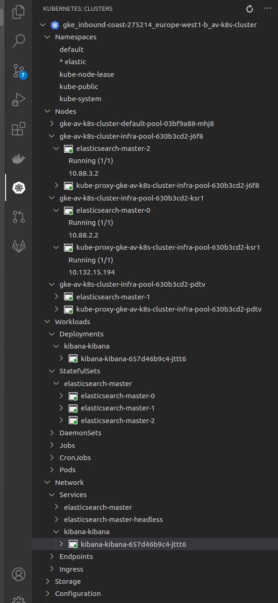

# Знакомство с ElasticSearch

## Цель: Научитесь разворачивать ES в AWS и использовать полнотекстовый нечеткий поиск

* Развернуть Instance ES – желательно в AWS
* Создать в ES индекс, в нём должно быть обязательное поле text типа string
* Создать для индекса pattern
* Добавить в индекс как минимум 3 документа желательно со следующим содержанием:  
   * «моя мама мыла посуду а кот жевал сосиски»  
   * «рама была отмыта и вылизана котом»  
   * «мама мыла раму»  
* Написать запрос нечеткого поиска к этой коллекции документов ко ключу «мама ела сосиски»
* Расшарить коллекцию postman (желательно сдавать в таком формате)
* Прислать  [ссылку на коллекцию](../elasticsearch/ElasticSearch_test_collection.postman_collection.json)

---


## Решение

1. Создаем k8s кластер в GKE

``` sh
cd /elasticsearch/infra  && terraform  apply -auto-approve  
```

2. Деплоим чарт [ElasticSearch](https://github.com/elastic/helm-charts)

``` sh
cd ./elasticsearch/ek  && terraform  apply -auto-approve  
```

Получаем требуемую инфраструктуру
* Nginx - ingress
* Kibana
* 3 ноды Elasticsearch




``` sh
export ES=http://elasticsearch.35.205.92.139.xip.io
curl -X GET "$ES?pretty"
```

``` json
{
  "name" : "elasticsearch-master-1",
  "cluster_name" : "elasticsearch",
  "cluster_uuid" : "a71G_dbCRy60c7qbveRxrg",
  "version" : {
    "number" : "7.9.3",
    "build_flavor" : "default",
    "build_type" : "docker",
    "build_hash" : "c4138e51121ef06a6404866cddc601906fe5c868",
    "build_date" : "2020-10-16T10:36:16.141335Z",
    "build_snapshot" : false,
    "lucene_version" : "8.6.2",
    "minimum_wire_compatibility_version" : "6.8.0",
    "minimum_index_compatibility_version" : "6.0.0-beta1"
  },
  "tagline" : "You Know, for Search"
}
```

3. Создаем индексы

``` sh
curl -X PUT "$ES/simple_index?pretty"
```

``` json
{
  "acknowledged" : true,
  "shards_acknowledged" : true,
  "index" : "simple_index"
}
```

``` sh
curl -X PUT "$ES/simple_index/_mapping?pretty" -H 'Content-Type: application/json' -d'
{
  "properties": {
    "text":  { "type": "text"}
  }
}
'
```
``` json
{
  "acknowledged" : true
}
```


4. Создаем pattern

``` sh
export KIBANA=http://kibana.35.205.92.139.xip.io
curl -XPOST   "$KIBANA/api/saved_objects/index-pattern/simple_index*" \
-H "Content-Type: application/json" \
-H "kbn-xsrf: true" -d '
{
  "attributes": {
    "title": "simple_index*"
  }
}
'
```


``` json
{"type":"index-pattern","id":"simple_index*","attributes":{"title":"simple_index*"},"references":[],"migrationVersion":{"index-pattern":"7.6.0"},"updated_at":"2020-10-31T17:28:30.228Z","version":"WzUzLDFd","namespaces":["default"]}
'
```

5. Наполняем данными

проверяем тестовым запросом
``` sh
curl  -X POST "$ES/simple_index/_doc/?pretty" -H 'Content-Type: application/json' -d'
{
	"text" : "test 111"
}'
```

``` json
{
  "_index" : "simple_index",
  "_type" : "_doc",
  "_id" : "_fi8f3UBeDRwo1dIDvgZ",
  "_version" : 1,
  "result" : "created",
  "_shards" : {
    "total" : 2,
    "successful" : 2,
    "failed" : 0
  },
  "_seq_no" : 0,
  "_primary_term" : 1
}
```


{{ES_URI}}/simple_index/_bulk
``` json
{"index":{}}
{	"text" : "моя мама мыла посуду а кот жевал сосиски"}
{"index":{}}
{	"text" : "рама была отмыта и вылизана котом"}
{"index":{}}
{	"text" : "мама мыла раму"}

```

``` sh
curl -X GET "$ES/simple_index/_search?pretty"                                           
```
``` json
{
  "took" : 468,
  "timed_out" : false,
  "_shards" : {
    "total" : 1,
    "successful" : 1,
    "skipped" : 0,
    "failed" : 0
  },
  "hits" : {
    "total" : {
      "value" : 6,
      "relation" : "eq"
    },
    "max_score" : 1.0,
    "hits" : [
      {
        "_index" : "simple_index",
        "_type" : "_doc",
        "_id" : "_fi8f3UBeDRwo1dIDvgZ",
        "_score" : 1.0,
        "_source" : {
          "text" : "test 111"
        }
      },
      {
        "_index" : "simple_index",
        "_type" : "_doc",
        "_id" : "YfjDf3UBeDRwo1dIL_n9",
        "_score" : 1.0,
        "_source" : {
          "text" : "test 111"
        }
      },
      {
        "_index" : "simple_index",
        "_type" : "_doc",
        "_id" : "0WbMf3UBUR3MvG1woeAF",
        "_score" : 1.0,
        "_source" : {
          "text" : "test 111"
        }
      },
      {
        "_index" : "simple_index",
        "_type" : "_doc",
        "_id" : "SN7Of3UBE29MtBW9Nu-u",
        "_score" : 1.0,
        "_source" : {
          "text" : "моя мама мыла посуду а кот жевал сосиски"
        }
      },
      {
        "_index" : "simple_index",
        "_type" : "_doc",
        "_id" : "Sd7Of3UBE29MtBW9Nu-u",
        "_score" : 1.0,
        "_source" : {
          "text" : "рама была отмыта и вылизана котом"
        }
      },
      {
        "_index" : "simple_index",
        "_type" : "_doc",
        "_id" : "St7Of3UBE29MtBW9Nu-u",
        "_score" : 1.0,
        "_source" : {
          "text" : "мама мыла раму"
        }
      }
    ]
  }
}
```

Запрос на нечеткий поиск
``` json
{
  "query": {
    "fuzzy": {
      "text": {
        "value": "мама ела сосиски",
        "fuzziness": "AUTO",
        "max_expansions": 50,
        "prefix_length": 0
      }
    }
  }
}
```
Ответ на нечеткий поиск
``` json
{
    "took": 17,
    "timed_out": false,
    "_shards": {
        "total": 1,
        "successful": 1,
        "skipped": 0,
        "failed": 0
    },
    "hits": {
        "total": {
            "value": 0,
            "relation": "eq"
        },
        "max_score": null,
        "hits": []
    }
}
```
[Коллекция Postman](../elasticsearch/ElasticSearch_test_collection.postman_collection.json)

## Материалы
* [Elastic поиск неточных соответствий](https://ruhighload.com/elastic+%D0%BF%D0%BE%D0%B8%D1%81%D0%BA+%D0%BD%D0%B5%D1%82%D0%BE%D1%87%D0%BD%D1%8B%D1%85+%D1%81%D0%BE%D0%BE%D1%82%D0%B2%D0%B5%D1%82%D1%81%D1%82%D0%B2%D0%B8%D0%B9)