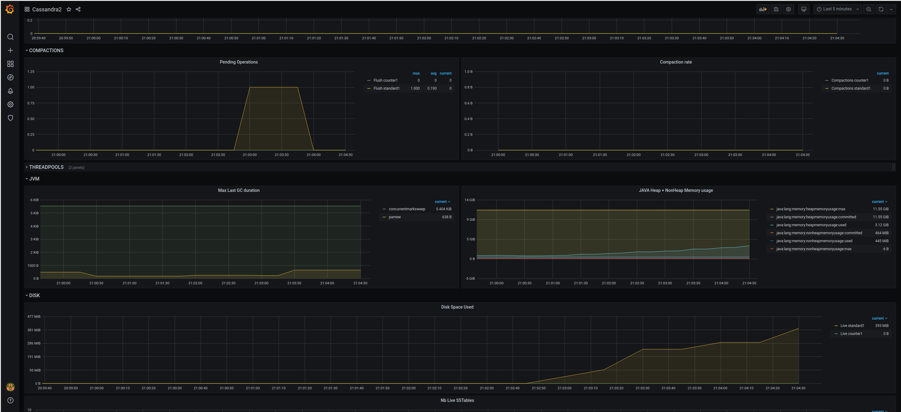
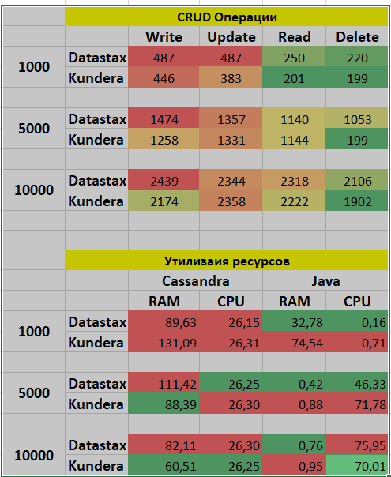

# Масштабирование и отказоустойчивость Cassandra. Часть 2


## Цель: В результате выполнения ДЗ вы изучите сторонние возможности восстановления Cassandra кластеров, замерите производительность вашего кода.

- забэкапить и восстановить используя 3DSnap ваш 3 узловой Cassandra кластер на Kubernetes из прошлого ДЗ(используя "How to Run Cassandra on Azure Kubernetes Service (AKS), part2.pdf" из материалов);
- выбрать два на ваш вкус драйвера к Cassandra и сравнить их по производительности и потреблению ресурсов (используя "Apache Cassandra with JPA.pdf" из материалов). 

### Решение

#### Мониторинг
1. Модифицируем [манифест](../cassandra/infra/main.tf)  для развертывания кластера с 3 нодами в разных зонах. Видимо что, IP узлов находтся в разных подсетях,  в консоли GCP - все узды попали на разные  зоны.
2. Подселим к ним мониторинг
* Prometheus
* Grafana

3. Логинимся на хост, запускаем стресс

```
cassandra-lab-0:/opt/bitnami/cassandra/tools/bin$ ./cassandra-stress write n=1000000 -mode thrift  user=admin password=password  

```

Можно  заметить: 
* объем  дисковых операций совпал с обземом off-heap операций в JVM - что означает что весь стресс - пришелся на Memory
* была 1 задержка  на flush для таблицы standard1
* задержек в записи комит лога не было

Итого для данной конфгурации, стресс тест проходит успешно в 99 перцентиле



---
#### 3DSnap

1. Поднимаем кластер k8s в GKE
2. Создаем ClusterRoleBinding
```
kubectl create clusterrolebinding cluster-admin-binding \
--clusterrole cluster-admin \
--user $(gcloud config get-value account) 
```
 
 ```
clusterrolebinding.rbac.authorization.k8s.io/cluster-admin-binding created
 ```

3. Устанливаем portworx

* Необходимо добавить права для нод K8s compute_rw storage_ro

* Создалим  сервисную роль
```
kubectl create clusterrolebinding av-cassandra-k8s-cluster-cluster-admin-binding \
    --clusterrole=cluster-admin --user=`gcloud info --format='value(config.account)'`
```

*  на сайте деплоймент манифест и применим его

```
kubectl aplay -f 'https://install.portworx.com/2.6?mc=false&kbver=1.16.15-gke.4901&oem=esse&user=563a274f-42fb-11eb-a2c5-c24e499c7467&b=true&s=%22type%3Dpd-standard%2Csize%3D30%22&kd=type%3Dpd-standard%2Csize%3D150&c=px-cluster-e06f8e96-0229-425b-a296-17fb1c18e97f&gke=true&stork=true&lh=true&st=k8s'
```

```
kubectl get pods -n=kube-system -l name=portworx                                   
NAME             READY   STATUS    RESTARTS   AGE
portworx-7sjw2   1/1     Running   0          6m40s
portworx-ckmtq   1/1     Running   0          6m40s
portworx-gm4wp   1/1     Running   0          6m40s
```

kubectl delete -f 'https://install.portworx.com/2.6?mc=false&kbver=1.16.15-gke.4901&oem=esse&user=563a274f-42fb-11eb-a2c5-c24e499c7467&b=true&s=%22type%3Dpd-standard%2Csize%3D30%22&kd=type%3Dpd-standard%2Csize%3D150&c=px-cluster-e06f8e96-0229-425b-a296-17fb1c18e97f&gke=true&stork=true&lh=true&st=k8s'

**Не работает** -  снапшоты не делаются.


Если делать по [инструкции](https://portworx.com/run-ha-cassandra-google-kubernetes-engine-gke/)  - то, при создании pvc  - получаем ошибку о просроченной лицензии.

```
Events:
  Type     Reason              Age                 From                         Message
  ----     ------              ----                ----                         -------
  Warning  ProvisioningFailed  20s (x7 over 117s)  persistentvolume-controller  Failed to provision volume with StorageClass "px-storageclass": rpc error: code = Internal desc = Failed to create volume: Volume (Name: pvc-f6943e4c-87dd-4733-a870-003386b3e461) create failed: License has expired
```

Судя по описанию на форуме поддержки, чинить это они не собираются, поскольку фича нормально работает в Enterprise  версии.

Времени убил много - пэтому изыскания прекращу - видимо надо искать другие средства бекапа или тратить больше врмени на изучение Portworx.


---

#### Driver Performance

1. Выбираем 2 драйвера 
   * Datastax
   * Kundera


  
2. Тестируем:
   * Убирваем в классе Main вызовы остальных драйверов.
   * Производим тестовые прогоны с число CRUD операция 1000 5000 10000
   * Замеряем утрилизацию ЦПУ и Памяти.
   * Подводим итоги. [Результаты тестов](./files/Результаты%20тестов.xlsx)



Как видим во всем нужен баланс, но на продолжительных тестах - Kunderа  - начинает получать преимущество. В общем выбирать надо от задачи. 