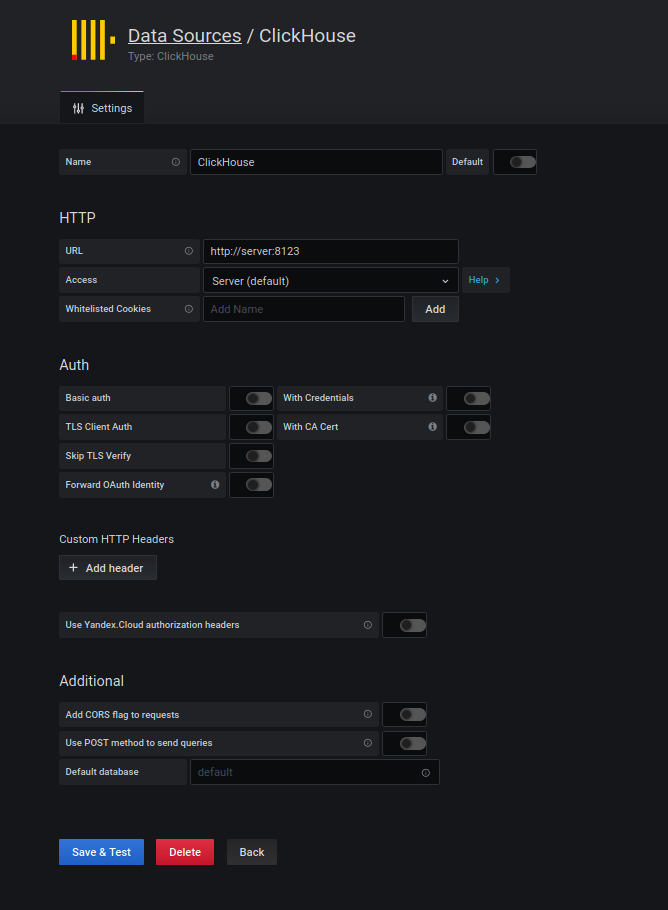
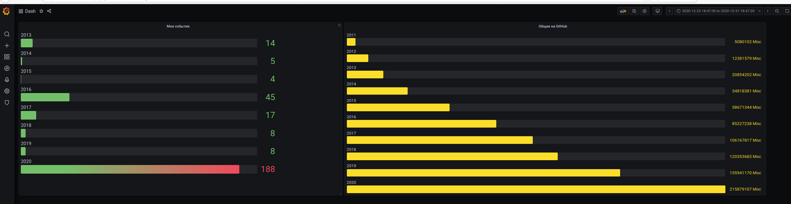

# ClickHouse

## Необходимо, используя [туториал](https://clickhouse.tech/docs/ru/getting-started/tutorial/) :
- развернуть БД;
- выполнить импорт тестовой БД;
- выполнить несколько запросов и оценить скорость выполнения.


## Решение

### развернуть БД
В наш век космических технологий - ставим в DockerCompose.

``` yaml
version: "3"
services:
    server:
     image: yandex/clickhouse-server
     ports:
     - "8123:8123"
     - "9000:9000"
     - "9009:9009"
     volumes:
     - /bigdata/ttt:/dataset:ro
     ulimits:
      nproc: 65535
      nofile:
       soft: 262144
       hard: 262144
    client:
      image: yandex/clickhouse-client
      command: ['--host', 'server']
```
Заводим, проверям подключением через DataGrip

### выполнить импорт тестовой БД

Идти по туториалу, для слабых духом - пойдем сразу на серьезные данные, датасет на 70 GB
[Качаем и ставиим ](https://github-sql.github.io/explorer/#how-to-download-the-data) с яндекса дамп с событиями  GitHub за все время

Монтируем директорию со скаченным файлом в DockerCompose
``` yaml
     volumes:
     - /bigdata/ttt:/dataset:ro
```

Подключаемся  и запускаем загрузку

```
pixz -d < github_events_v2.native.xz | clickhouse-client --query "INSERT INTO github_events FORMAT Native"
```

Минут через 30 когда Место на SSD начало стремительно  заканчиваться, остановился - загрузилось 815_374_613  записей - достаточно.

### выполнить несколько запросов и оценить скорость выполнения

Начинаем играться

``` sql
select    toYear ( created_at) as "Год", count(1) as "Количество событий"  from github_events
group by toYear (  created_at)
order by toYear ( created_at)

```

| Год | Количество событий |
| :--- | :--- |
| 2011 | 5080101 |
| 2012 | 12381578 |
| 2013 | 20854201 |
| 2014 | 34818380 |
| 2015 | 58671343 |
| 2016 | 85227237 |
| 2017 | 106167816 |
| 2018 | 120353682 |
| 2019 | 155941169 |
| 2020 | 215879106 |

``` sql
select count(1) from github_events
```
| count\(1\) |
| :--- |
| 815374613 |


``` sql
select  actor_login , toYear ( created_at) , count(1)from github_events
where actor_login in ( 'vasiliev-alexey')
group by toYear (  created_at), actor_login
order by toYear ( created_at), actor_login
```

| actor\_login | toYear\(created\_at\) | count\(1\) |
| :--- | :--- | :--- |
| vasiliev-alexey | 2013 | 14 |
| vasiliev-alexey | 2014 | 5 |
| vasiliev-alexey | 2015 | 4 |
| vasiliev-alexey | 2016 | 45 |
| vasiliev-alexey | 2017 | 17 |
| vasiliev-alexey | 2018 | 8 |
| vasiliev-alexey | 2019 | 8 |
| vasiliev-alexey | 2020 | 188 |


*В целом неплохо, ответы приходят менее чем за 16 секунд - очень даже хорошо для такого датасета.*

### Задание со * - Grafana

Установим Grafana в Docker-Compose  и [плагин с DataSource](https://grafana.com/grafana/plugins/vertamedia-clickhouse-datasource)

1. Добавим возможость устанваливать неподписанные плагины
```
        - GF_PLUGINS_ALLOW_LOADING_UNSIGNED_PLUGINS=vertamedia-clickhouse-datasource 
```
2. Подключимся к  контейнеру и подгрузим плагин, перестартуем его
```
grafana-cli plugins install vertamedia-clickhouse-datasource

```
Создадим DataSource 


И Dashboard


Дашшборд [приложим](../clickhouse/clickhouse-github-dashboard.json) к ДЗ

---
Метериалы
https://github-sql.github.io/explorer/